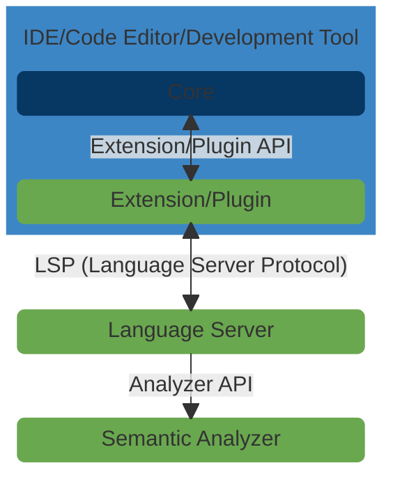

I am proud to announce the successful completion of the [Web3 Foundation](https://web3.foundation/) grant for
developing [ink! analyzer](https://github.com/ink-analyzer) - a collection of modular and reusable libraries and tools
for semantic analysis of [ink!](https://use.ink/) smart contract code.

ink! analyzer aims to improve [ink!](https://use.ink/) language support in
[integrated development environments (IDEs)](https://en.wikipedia.org/wiki/Integrated_development_environment),
[source code editors](https://en.wikipedia.org/wiki/Source-code_editor) and other development tools by
providing modular and reusable building blocks for implementing language features
(e.g. diagnostic errors, quick fixes, code completion suggestions, code/intent actions and hover content e.t.c)
for the [ink! programming language](https://use.ink/) which is used for writing smart contracts for blockchains
built with [Substrate](https://substrate.io/).

- Semantic Analyzer ([source code](https://github.com/ink-analyzer/ink-analyzer/tree/master/crates/analyzer),
  [crates.io](https://crates.io/crates/ink-analyzer), [docs.rs](https://docs.rs/ink-analyzer/latest/ink_analyzer/)).
- Language Server ([source code](https://github.com/ink-analyzer/ink-analyzer/tree/master/crates/lsp-server),
  [binary/executable releases](https://github.com/ink-analyzer/ink-analyzer/releases),
  [crates.io](https://crates.io/crates/ink-lsp-server), [docs.rs](https://docs.rs/ink-lsp-server/latest/ink_lsp_server/)).
- Visual Studio Code Extension ([source code](https://github.com/ink-analyzer/ink-vscode),
  [VS Code Marketplace listing](https://marketplace.visualstudio.com/items?itemName=ink-analyzer.ink-analyzer),
  [VSIX releases](https://github.com/ink-analyzer/ink-vscode/releases)).

<!-- truncate -->

## Problem

ink! is an [Embedded Domain Specific Language (eDSL)](https://wiki.haskell.org/Embedded_domain_specific_language)
that you can use to write [WebAssembly](https://webassembly.org) based smart contracts in the
[Rust](https://www.rust-lang.org/) programming language. In fact,
["ink! is just standard Rust in a well-defined "contract format" with specialized `#[ink(…)]` attribute macros"](https://use.ink/getting-started/creating-an-ink-project).

This allows ink! developers to leverage Rust tooling like [clippy](https://doc.rust-lang.org/clippy/),
[cargo](https://doc.rust-lang.org/cargo/), [crates.io](https://crates.io/) and excellent IDE/code editor support via
[rust-analyzer](https://rust-analyzer.github.io/) and [IntelliJ Rust](https://intellij-rust.github.io/).

However, relying on only generic Rust language support in IDEs, code editors and other development tools has some
significant limitations for the developer experience including:

- No language support (e.g. diagnostic errors/warnings and quick fixes) for ink!'s domain specific semantic rules for
  smart contracts (e.g. exactly one `#[ink(storage)]` struct, at least one `#[ink(message)]` method and the same for
  `#[ink(constructor)]`, ink! attributes should be applied to items of the correct type,
  ink! `env` and `environment` argument values must `impl Environment` e.t.c).
- Inconsistent editor experience with issues like no code completion and/or hover content for some
  ink! attribute arguments (e.g. `#[ink(payable)]`) because
  [macro expansion/name resolution and trait resolution are hard problems for generic IDE/code editor tools](https://rust-lang.github.io/compiler-team/working-groups/rls-2.0/#scope-and-purpose)
  (see also [https://rust-analyzer.github.io/blog/2021/11/21/ides-and-macros.html](https://rust-analyzer.github.io/blog/2021/11/21/ides-and-macros.html)).

## Solution

To solve the above challenges and improve ink! language support in IDEs, code editors and other development tools,
ink! analyzer creates two main components:

- [A modular domain-specific semantic analysis library for ink!](https://github.com/ink-analyzer/ink-analyzer/tree/master/crates/analyzer)
  built on a resilient and lossless parser.
- A [Language Server Protocol (LSP)](https://microsoft.github.io/language-server-protocol/) [implementation](https://github.com/ink-analyzer/ink-analyzer/tree/master/crates/lsp-server)
  built on top of the aforementioned semantic analysis library.

These two components can be reused to add ink! language support to multiple IDEs, code editors and other development tools.

In particular, a large number of IDEs and code editors support LSP servers either via configurable LSP clients or
robust LSP client libraries/APIs/modules, including
[Visual Studio Code, Visual Studio, Vim / Neovim, Emacs, Atom, Sublime Text, Acme, Lapce, Eclipse and many more](https://microsoft.github.io/language-server-protocol/implementors/tools/).

ink! analyzer makes it relatively easy for:

- Users to enable ink! language support for their IDE, code editor or other development tool if it has either
  a native/built-in or third-party LSP client that can be configured to launch an LSP server using an executable command
  (i.e. the path to an
  [installed ink! Language Server binary](https://github.com/ink-analyzer/ink-analyzer/tree/master/crates/lsp-server#installation))
  and can use stdio (standard in/standard out) as the message transport.
- Developers to either build extensions/plugins/integrations that add ink! language support to any tool with robust
  LSP client libraries/APIs/modules, or add first-class ink! language support to an existing LSP client
  (e.g. an open-source extension/plugin/integration).

The latter option typically provides a better user experience as the user doesn't have to manually install (and update)
the ink! Language Server as it can be bundled (or installed/updated) by the extension/plugin/integration.

Therefore, in addition to
[distributing compiled ink! Language Server (`ink-lsp-server`) binaries for most of the major platforms/architectures](https://github.com/ink-analyzer/ink-analyzer/releases),
ink! analyzer additionally distributes a
[Visual Studio Code extension](https://marketplace.visualstudio.com/items?itemName=ink-analyzer.ink-analyzer)
that ships with a bundled ink! Language Server as a showcase and
[reference implementation](https://github.com/ink-analyzer/ink-vscode) for the latter use case.

## Architecture



_Figure 1: ink! analyzer - LSP based Architecture Diagram_

### 1. [Semantic Analyzer](https://github.com/ink-analyzer/ink-analyzer/tree/master/crates/analyzer)

The semantic analyzer is responsible for parsing the smart contract code, analyzing it based on ink!'s semantic rules
for smart contracts and returning semantic information for other components to consume.

It is written in [Rust](https://www.rust-lang.org/) and uses rust-analyzer's
[ra_ap_syntax](https://docs.rs/ra_ap_syntax/latest/ra_ap_syntax/) crate for generating the syntax tree of
the smart contract code that it analyzes.

It uses [ra_ap_syntax](https://docs.rs/ra_ap_syntax/latest/ra_ap_syntax/) instead of other Rust parsing and
syntax tree libraries because ink! analyzer has similar
[design goals](https://github.com/rust-lang/rust-analyzer/blob/master/docs/dev/syntax.md#design-goals) to rust-analyzer.
The most important being that parsing should be:

- resilient (even if the input is invalid, parser tries to see as much syntax tree fragments in the input as it can).
- lossless (even if the input is invalid, the tree produced by the parser represents it exactly).

As a concrete example, while ink!'s [ink_ir](https://docs.rs/ink_ir/latest/ink_ir/) crate includes syntax tree and
intermediate representation (IR) modules, it uses [syn](https://docs.rs/syn/latest/syn/) as its parser.
[Syn](https://docs.rs/syn/latest/syn/) however,
(being ["geared toward use in Rust procedural macros"](https://docs.rs/syn/latest/syn/))
[assumes "that all input to it is well-formed"](https://github.com/rust-lang/rfcs/pull/2256#issuecomment-353753261).
So for the ink!/Rust code snippet below that contains only one invalid line, [syn](https://docs.rs/syn/latest/syn/)
simply returns an error while [ra_ap_syntax](https://docs.rs/ra_ap_syntax/latest/ra_ap_syntax/) still generates a
lossless syntax tree with errors represented by "error nodes", thus allowing analysis to still be performed on
the rest of the valid code.

```rust
#[ink::contract]
mod flipper {

    #[ink(storage)]
    pub struct Flipper {
        value: bool,
    }

    bad statement; // This is an invalid line
}
```

This makes [syn](https://docs.rs/syn/latest/syn/) (and by extension ink!'s
[ink_ir](https://docs.rs/ink_ir/latest/ink_ir/) crate) unsuitable for our IDE/code editor use case.

### 2. [Language Server](https://github.com/ink-analyzer/ink-analyzer/tree/master/crates/lsp-server)

The language server implements the [Language Server Protocol (LSP)](https://microsoft.github.io/language-server-protocol/)
and acts as a backend that provides language support features like diagnostic errors, code completion suggestions,
code/intent actions and hover content to IDEs, code editors and other development tools.
It uses the semantic analyzer as the engine for providing ink! language support features by:

- translating LSP requests into semantic analyzer interface calls.
- translating semantic analysis results into corresponding LSP types.

It can be reused by multiple IDEs, code editors and other development tools that support LSP servers either via
native/built-in LSP clients or third-party LSP client extensions/plugins/integrations.

It is written in [Rust](https://www.rust-lang.org/) and uses:

- rust-analyzer's [lsp-server](https://docs.rs/lsp-server/latest/lsp_server/) crate to handle LSP protocol handshaking
  and parsing messages
- the [lsp-types](https://docs.rs/lsp-types/latest/lsp_types/) crate for LSP type definitions.

### 3. Extension/Plugin/Integration

Extensions/plugins/integrations add ink! language support to a specific IDE, code editor or development tool by
communicating with the language server running as a separate process using the
[Language Server Protocol](https://microsoft.github.io/language-server-protocol/) via [JSON-RPC](https://www.jsonrpc.org/).

Only a [VS Code extension](https://marketplace.visualstudio.com/items?itemName=ink-analyzer.ink-analyzer) is currently
[implemented](https://github.com/ink-analyzer/ink-vscode).
The VS Code extension is written in [TypeScript](https://www.typescriptlang.org/) using
VS Code's [extension API](https://code.visualstudio.com/api) and
[language server client library](https://www.npmjs.com/package/vscode-languageclient).

## Diving Deeper

You can learn more about the above components as well as other lower-level crates/modules used by ink! analyzer,
including: installation, development, usage and testing instructions, library documentation, low-level technical and
architectural descriptions, and access the source code using the following resources:

- [Rust monorepo](https://github.com/ink-analyzer/ink-analyzer) that includes:
  - The [semantic analyzer](https://github.com/ink-analyzer/ink-analyzer/tree/master/crates/analyzer),
    [language server](https://github.com/ink-analyzer/ink-analyzer/tree/master/crates/lsp-server) and
    [other crates](https://github.com/ink-analyzer/ink-analyzer/tree/master/crates).
  - [An architectural description of all the various crates and how they relate to each other](https://github.com/ink-analyzer/ink-analyzer#readme).
  - Crate specific READMEs with installation and usage instructions, links to documentation on docs.rs and
    testing instructions.
  - Extensive inline source documentation.
- [Source code repository for the Visual Studio Code extension](https://github.com/ink-analyzer/ink-vscode) that includes:
  - A [README](https://github.com/ink-analyzer/ink-vscode#readme) that describes the currently implemented features and
    settings for the extension.
  - A detailed [Development and Testing guide](https://github.com/ink-analyzer/ink-vscode/blob/master/DEVELOPMENT.md).
  - Extensive inline source documentation.
- Rust crates published on crates.io:
  - [Semantic Analyzer (ink-analyzer crate)](https://crates.io/crates/ink-analyzer)
  - [Language Server (ink-lsp-server crate)](https://crates.io/crates/ink-lsp-server)
  - [Intermediate Representation (ink-analyzer-ir crate)](https://crates.io/crates/ink-analyzer-ir)
  - [Procedural Macros (ink-analyzer-macro crate)](https://crates.io/crates/ink-analyzer-macro).
- Documentation for Rust crates published on docs.rs:
  - [Semantic Analyzer (ink-analyzer crate)](https://docs.rs/ink-analyzer/latest/ink_analyzer/)
  - [Language Server (ink-lsp-server crate)](https://docs.rs/ink-lsp-server/latest/ink_lsp_server/)
  - [Intermediate Representation (ink-analyzer-ir crate)](https://docs.rs/ink-analyzer-ir/latest/ink_analyzer_ir/)
  - [Procedural Macros (ink-analyzer-macro crate)](https://docs.rs/ink-analyzer-macro/latest/ink_analyzer_macro/)
- Distributable releases for major operating systems (Windows, Linux and macOS) and processor architectures
  (x86_64/amd64 and arm64/aarch64) for:
  - [Language Server binaries/executables](https://github.com/ink-analyzer/ink-analyzer/releases).
  - [VS Code extension packages](https://github.com/ink-analyzer/ink-vscode/releases).
- [Published packages for the extension on the Visual Studio Code marketplace](https://marketplace.visualstudio.com/items?itemName=ink-analyzer.ink-analyzer).

## Conclusion

ink! analyzer is only at the very beginning of its development, so issues, bug reports, PRs and feature requests are
welcome at the aforementioned GitHub repositories 🙂.

Special thanks to the [Web3 Foundation](https://web3.foundation/) for funding ink! analyzer's development via
a generous grant.
